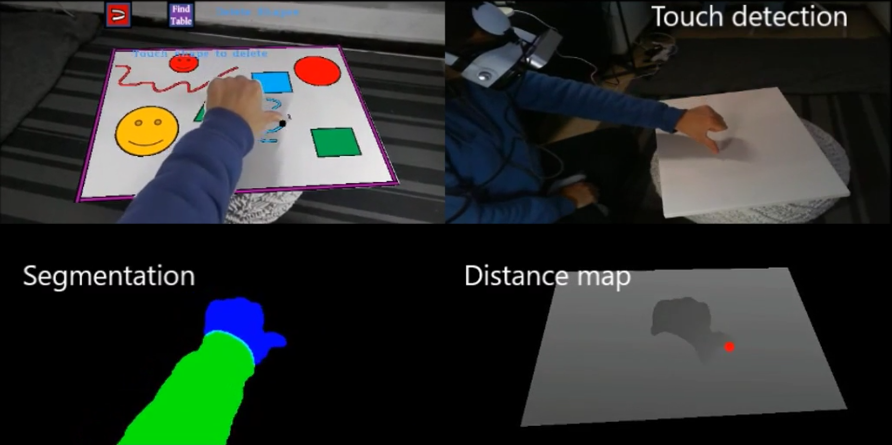
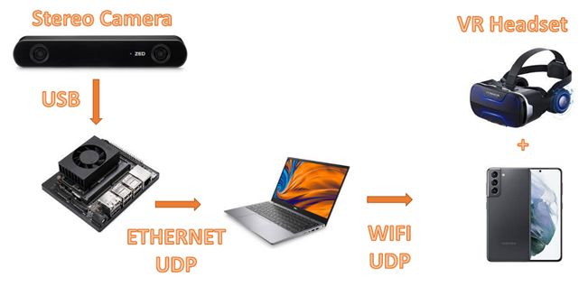

# IMP_AR_project

## Overview

Augmented reality (AR) is one of the most popular technologies, and the tech giants such as Apple, Meta, Google, and more invest hundreds of millions. These days AR still haven't made a breakthrough, and we decided to join the challenge.
We created an AR application with a stereo camera, PC, and mobile phone that transforms any table into a tablet or gamepad.

<iframe width="560" height="315" src="https://www.youtube.com/embed/I7b0lHkV0Ug" title="YouTube video player" frameborder="0" allow="accelerometer; autoplay; clipboard-write; encrypted-media; gyroscope; picture-in-picture" allowfullscreen></iframe>

## Project Documentation

For an explanation of the project, there is [documentation](Documantation/AR_pdf.pdf).

## Hardware

The leading hardware that we used in the project:
- ZED stereo camera
- Nvidia Xavier (Capture frames in high FPS)
- i7 CPU PC (Without GPU)
- Samsung Galaxy S21
- Samsung Tab S7 

## Perquisites

- Opencv-python 4.5 compiled with gstreamer
- Android Studio
  - Download [Gstreamer android tutorial](https://gstreamer.freedesktop.org/documentation/tutorials/android/video.html).
  - Replace the files from Android folder inside tutorial 3.
  - Install the app on the phone.
- ZED sdk installed on the Jetson Xavier.
- [Scrcpy](https://github.com/Genymobile/scrcpy)
## Run the project

1. Connect the camera to the jetson and run the file Zed\zed_opencv.py.
2. Connect the tablet to the PC and run the software Scrcpy to get the tablet screen.
3. Run the file Main\main.py   
Make sure that you changes all the IP's as the local network.